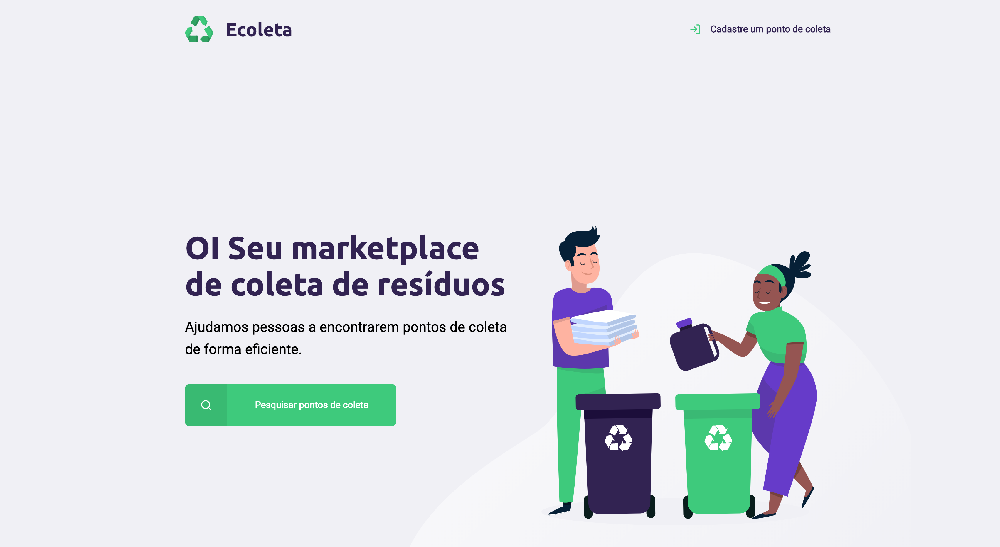

<div align="center">
  
</div>

<br>

<h3 align="center">
  🚀 Next Level Week - Starter Edition 🚀
</h3>

<br>

### 📝 About the project
Project aimed at ecological purposes. A connection between companies and / or entities that collect organic or inorganic waste from people who need to dispose of these materials.

The platform will provide two areas, the first is for the collecting entity to register by informing the address and items collected by it, the second is the user area where it will inform the city and state where it lives to find entities registered on the platform, considering to go to the site and dispose of correctly.

<br>

### 🛠 Technologies
- HTML
- CSS (responsive)
- JavaScript
- Database sqlite3

<br>

### 🏁 Starting
Clone the project: `git clone https://github.com/leopacciulli/NextLevelWeek-Starter.git`

<br>

🤖 To run the **Project**.

````zsh
# to enter in the folder
$ cd NextLevelWeek-Starter

# to run the project
$ npm start

# to your browser in
$ http://localhost:3000/
````

---

<h3 align="center">
  Made with love by 💙 Leonardo Pacciulli
</h3>

<p align="center">
  <a href="https://www.linkedin.com/in/leonardo-pacciulli">
    
  </a>
  <a href="https://www.facebook.com/paculli">
    
  </a>
  <a href="https://www.instagram.com/leopacciulli/">
    
  </a>
</p>
